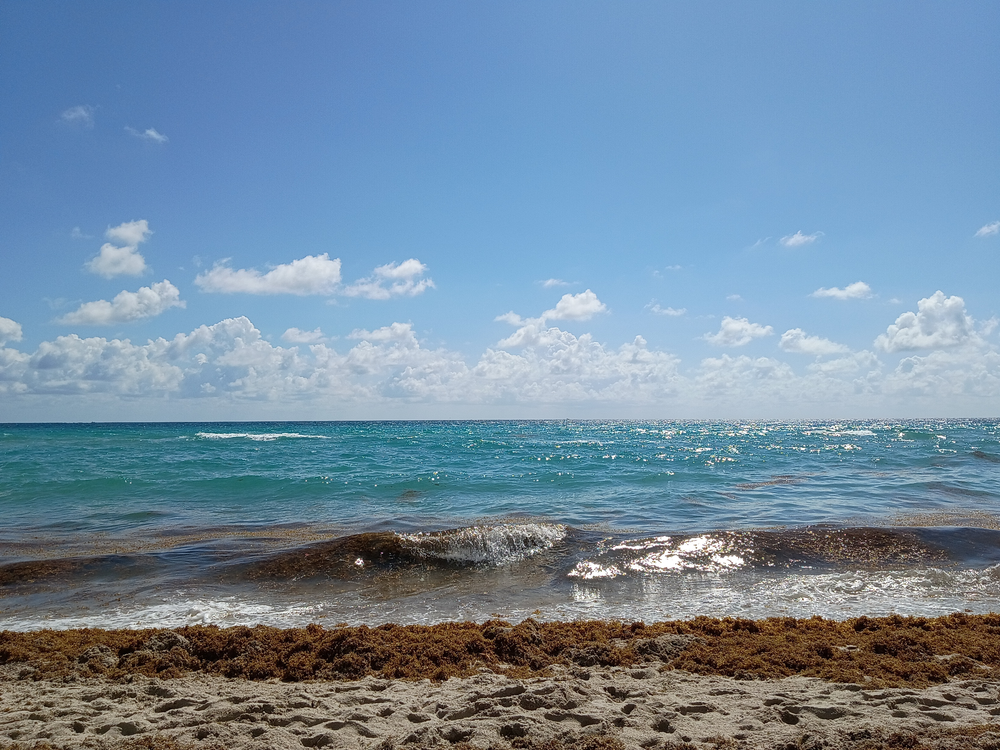
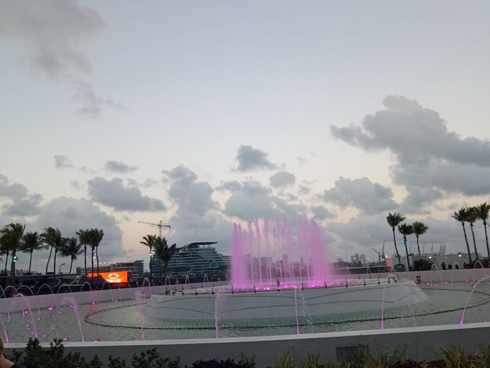

I woke up that morning carrying a conversation I couldn't quite shake. A minor disagreement, in the grand scheme of things. But one that exposed a growing wound I had, up to that point, refused to acknowledge. I was spread too thin and spending too much time working on things nobody would ever see. Ideas that never seemed to find the space to become what I thought they could be. Nobody else saw the wound. They didn't realize they were deepening it, either.

For months - really, over a year at this point - a pattern had begun to emerge. I was trusted to solve problems, but not to shape the future. People wanted my labor more readily than my judgment. And still, all weekend, my phone kept buzzing with more of it.

It was with this in the back of my mind, that we headed for Dania Beach. I'd never seen the ocean before. Nothing could've prepared me for it. What struck me most was that it appeared so large as to be unbounded. Basking in the sun with my love, I saw not emptiness, but possibility. I felt small - but not in the way people usually say that.

Typically when a person says they felt small, they mean to say they felt as though they had shrunk somehow, becoming vulnerable. But in this case I just realized how small I was in the first place. How much more space there was in the Earth that I'd never seen. How much room there was for me to grow into it. 

Being in the heat, the water, the waves crashing against my body and thrashing me around was . . . Home. Not home in the sense of belonging. Not yet. Something deeper. A connection to the Earth itself. 

I didn't wanna leave. But she was in charge. So we did. What I saw after that, has shaped every single day since. The Atlantic was just the beginning.

Nothing about dusty, empty, Oklahoma could've readied me for Miami. There was a voice whispering in the back of my mind as we passed each building, drove through each block, each row of gorgeous restaurants that I wanted to eat at despite not actually being even slightly hungry. I didn't know what it was saying at the time, but I heard it. And whatever it was saying, I was hungry to understand.

Things slowly started to catalyze in my mind throughout Friday evening. Not long after the beach we were at Ultra. Again - I've never seen or participated in anything like this. Thousands of people. Half a dozen stages. It felt like proof of what an *idea* is capable of. The entire city seemed to bend around it, with one of its largest parks transformed into the venue.

That energy carried throughout the whole night. It peaked during - I think - the ILLENIUM set. There was a light show, of course. But I wasn't really paying attention. I was too busy watching her dance and living in the moment. 

Suddenly I realized all the lights around me were purple. They were red/orange, all throughout the rest of the night, before and after. It wasn't just *any* purple. If you're reading this, it's one you damn well better have seen before. It was *my* purple. The shade was . . . exactly right. I looked around, and I saw the light show actually reached past the venue itself. Most of the buildings surrounding it were all LIT UP bright, beautiful purple. 

The song playing in that moment never left my heart.

[DJ Snake - Let Me Love You](https://www.youtube.com/watch?v=euCqAq6BRa4).

I had never heard it before. I didn't know anything about it. I didn't know what it meant, what it was about. I just knew that, in that moment, with her dancing beside me and the entire city glowing purple, it felt like the universe had chosen a soundtrack - one it took months to truly understand.

That was when S3kshun8 heard the call, instead of just Dave. The whisper from earlier, in the back of my mind, was now a screeching demand surrounding my entire being.

*This is what you were reaching for.*

None of the individual elements made it real - not the crowd, the music, the yachts, or the lights. All of it reached out for me at once and captured something in me I still don't know how to describe. S3kshun8 became *real* in that moment. It wasn't just an idea, a profile picture, a name I lifted from a game nobody else likes. 

It was an *experience*, defined by the sublime.

I couldn't really be present for the rest of the night. Until we left I kept thinking about the *shine* of all those lights as we went from stage to stage, artist to artist, stranger to stranger. Because the grandeur of this place, contrasted with the previous night's conflict, taught me something - I'd been giving my best self away, and getting almost nothing back.

I had spent so much of my life seeking *approval* and *consent*, being terrified to assert myself. This place made no apologies for itself. The people at the rave didn't apologize for the way they looked, or ask permission to wear crazy (cool) outfits, or do dances nobody else was doing, or anything, really. We all just existed in this giant space, enjoying it - and each other. 

What I was doing could continue. But the exact way I was doing it? It was killing me. Every minute belonged to someone else, and I could not survive doing it that way any longer.

Then the last piece clicked as we were leaving the show that night. We'd been walking for a few minutes. The city was shockingly quiet. It was somewhere around one or two in the morning. I'd expected more to be happening for such a large city, but it was . . . asleep. I was remarking upon it to myself when I realized we were standing outside a Ferrari store.

I hadn't known one even existed until it was staring me in the face - Right in front of one of the display cars. 

Now, I have always been one to appreciate craftsmanship. Regardless of what the thing is. When I shop GPUs, I want the *fastest* cards, with the best VRMs and power delivery. When I move, I want a well-maintained home. It's not an issue of monetary value - it's an issue of valuing what you produce enough to make it *great*, given what you have available to you. If I don't see YOU in the thing you're trying to sell me - your pride, your care, your obsession - then why should I care?

Never before have I thought a car was beautiful, or well-crafted. But this one was. Deep, dark blue. White stripe down the center, with red ones parallel to it. An absolutely gorgeous piece of machinery. My eyes darted around the store to the rest of the displays as she stood there holding my hand, wondering what I was doing. Then I saw it, on the back wall. A quote, from Enzo Ferrari. A man whom I didn't even know existed until that exact moment.

*Passion cannot be described - It can only be lived.*

I really don't think any single statement has ever resonated with me so deeply. I saw us, in that specific car. Driving it out of the store. Into our condo somewhere there in town. It was so real and vivid in my mind. A puzzle I didn't realize I'd been solving was suddenly answered.

I realized in this moment that my problem wasn't *caring* more than anyone else - it was pouring an extraordinary amount of passion into a place that didn't have the structure to receive it.

So I decided I had to ask for permission one last time. To stop asking for permission and start doing.

It took us a while to make it back to the motel. On the way I ruminated about what the *exact* nature of the question was. What I really needed to change. What needs to be given up. How priorities should be refactored so we can stay this way, together, for as long as life allowed.

She could tell something was on my mind, because I wouldn't lay down. My mind was too active. My fear, ultimately, was that I would have to become someone I didn't want to be, to get the things I want out of life.

I posed this question to her. Should I make that trade? Should I be willing to give things up, to have things I want more? Would it be worth it?

Her answer came so fast, and was so short, I almost felt stupid for even having asked the question in the first place.

Do whatever you have to do for *us*.

I thought I heard her clearly in that moment as I shut the lights off. In retrospect, I don't think either of us fully knew what the other meant.

At the time, that was more than enough for me. I could *see* the path now, and I felt unafraid to walk it.

But even as I faded into unconsciousness, I wondered if she would be there on the other end of *my* journey.
